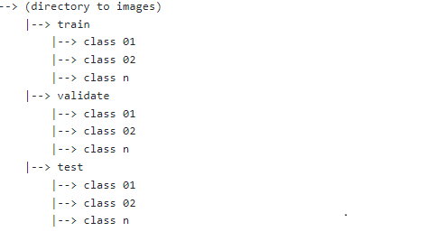

The following script is able to let user choose the **[models - batch sizes]** to run experiments with. 

The script autonomusly saves **[training accuracy graph, training loss graph, confusion matrices, classification_report, best weight only using callbacks]**.  

The script is meant for multi-class clasification.

The script is friendly to use with only needing to provide the location of your images It expects a structure as follows:

Removing the need for test data set can be done through simply commenting anything related to it through out the code.

The Experimets create one folder name 'experiments' and proceedes to save everything in the following structure:

Cotributed can create variables for different learning rates, model optimizers, etc.

https://www.linkedin.com/in/khalid-alnujaidi-9909141a7/
